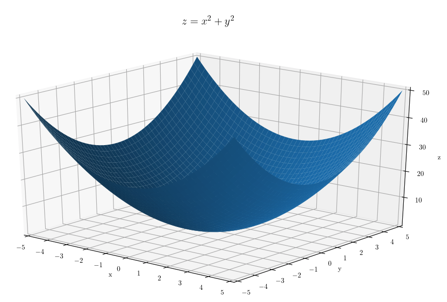
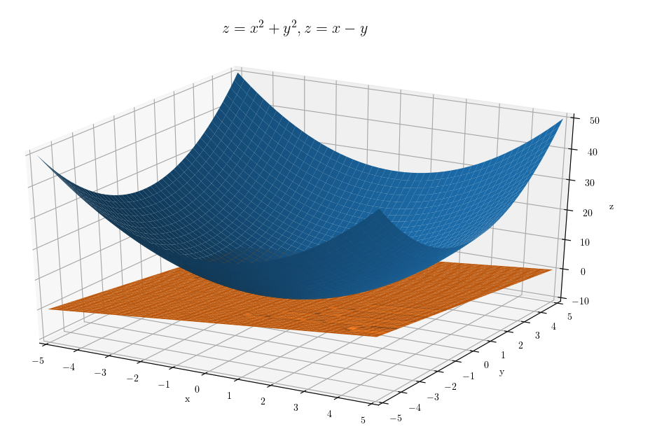

# math
Code related to fun &amp; exciting things about math

# File list under the project directory

| File name | Note | |
|---|---|---|
| plothelper.py | A helper class to deal with matplotlib parameter settings so that the caller can focus on the function definition.  Check out below examples to see that you only need a few lines of code to plot a graph using this class. | |
| plot_sigmoid | Plot a sigmoid function using matplotlib. |  |
| plot_sigmoid_derivative | Plot a derivative of the sigmoid function using matplotlib. |  |
| plot_e | Plot y = e\*\*x (Euler's number) using matplotlib. |  |
| plot_e_to_the_minus_x | Plot y = e\*\*(-x) using matplotlib. |  |
| plot_1_plus_e_to_the_minus_x | Plot y = 1 + e\*\*(-x) using matplotlib. |  |
| plot_1_plus_e_to_the_minus_x_extra | Plot y = 1 + e\*\*(-x) and sigmoid using matplotlib. |  |
| plot_x_squared_plus_y_squared | Plot z = x\*\*2 + y\*\*2 using matplotlib. |  |
| plot_x_squared_plus_y_squared_extra | Plot z = x\*\*2 + y\*\*2 and z = x - y using matplotlib. | |
| plot_cosh_x | Plot y = cosh(x) using matplotlib. | |
| plot_sinh_x | Plot y = sinh(x) using matplotlib. | |
| plot_e_to_the_x_plus_e_to_the_minus_x | Plot y = e\*\*x + e\*\*-x using matplotlib. | |
| plot_e_to_the_x_minus_e_to_the_minus_x | Plot y = e\*\*x - e\*\*-x using matplotlib. | |
