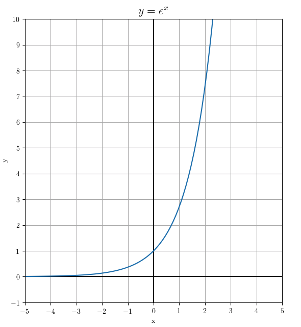

# math
Code related to fun &amp; exciting things about math

# File list under project

| File name | Note | |
|---|---|---|
| plot_e | Plot y = e**x (Euler's number) using matplotlib. |  |
| plot_e_to_the_minus_x | Plot y = e**(-x) (Euler's number) using matplotlib. |  |
| plot_1_plus_e_to_the_minus_x | Plot y = 1 + e**(-x) (Euler's number) using matplotlib. |  |
| plot_1_plus_e_to_the_minus_x_extra | Plot y = 1 + e**(-x) (Euler's number) and sigmoid using matplotlib. |  |
| plot_sigmoid | Plot sigmoid function using matplotlib. |  |
| plothelper.py | A helper class to deal with matplotlib parameter settings so that the caller can focus on the function definition. | |
